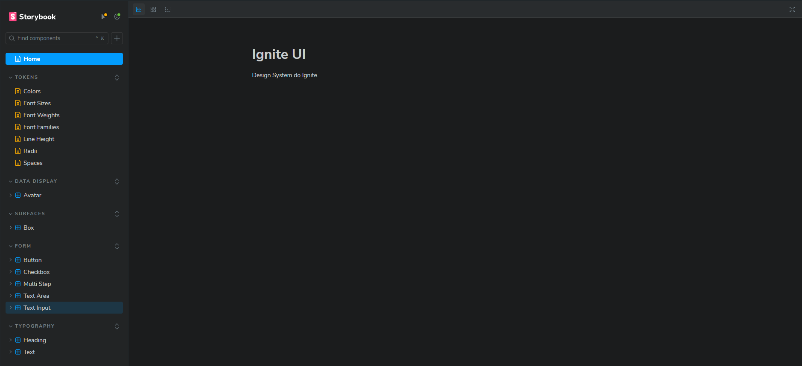

<h1 align="center">
  IgniteUI - Design System
</h1>

<p align="center">
  

  <a href="https://www.linkedin.com/in/caioperess/" target="_blank" rel="noopener noreferrer">
    
  </a>

  

  <a href="https://github.com/caioperess/ignite-ui-design-system/commits/master">
    
  </a>

  <a href="https://github.com/caioperess/ignite-ui-design-system/issues">
    
  </a>
</p>

<p align="center">
  <a href="#-about-the-project">About the project</a>&nbsp;&nbsp;&nbsp;|&nbsp;&nbsp;&nbsp;
  <a href="#-technologies">Technologies</a>&nbsp;&nbsp;&nbsp;|&nbsp;&nbsp;&nbsp;
  <a href="#-components">Components</a>&nbsp;&nbsp;&nbsp;|&nbsp;&nbsp;&nbsp;
  <a href="#-getting-started">Getting started</a>&nbsp;&nbsp;&nbsp;|&nbsp;&nbsp;&nbsp;
  <a href="#-layout">Layout</a>
</p>



## 📰 About the project

This repository presents a design system crafted to enhance and streamline the development of user interfaces.

Organized as a monorepo, the project structure allows for seamless management and consistent updates across all components. This setup not only simplifies the development workflow but also ensures that all parts of the design system work harmoniously together.

With a focus on creating high-quality and accessible UI components, the design system leverages the power of StoryBook for component development and documentation. This enables developers to build, test, and showcase components in isolation, promoting better collaboration and faster iterations.

## 🚀 Technologies

Technologies that I used to develop this application

- [Changesets](https://github.com/changesets/changesets)
- [ReactJS](https://react.dev/)
- [TypeScript](https://www.typescriptlang.org/)
- [StoryBook](https://storybook.js.org/)
- [Radix-UI](https://www.radix-ui.com/)
- [StichesJS](https://stitches.dev/)
- [Turborepo](https://turbo.build/)

## 🧩 Components

- [x] Avatar
- [x] Box
- [x] Button
- [x] CheckBox
- [x] Heading
- [x] MultiStep
- [x] Text
- [x] TextArea
- [x] TextInput
- [x] Toast
- [x] Tooltip

## 💻 Getting started

### Requirements

**Clone the project and access the folder**

```bash
$ git clone https://github.com/caioperess/ignite-ui-design-system.git && cd ignite-ui-design-system
```

**Follow the steps below**

```bash
# Run all the commands bellow on the root folder

# Install the dependencies
$ pnpm i

# To start the project in dev mode, run this command
$ pnpm dev

# To build the project, run this command
$ pnpm build
```

## 🎨 Layout
- [Figma](https://www.figma.com/community/file/1161274296921389678/ignite-call)
---

Made with 💙 by Caio Peres 👋 [See my linkedin](https://www.linkedin.com/in/caioperess/)
